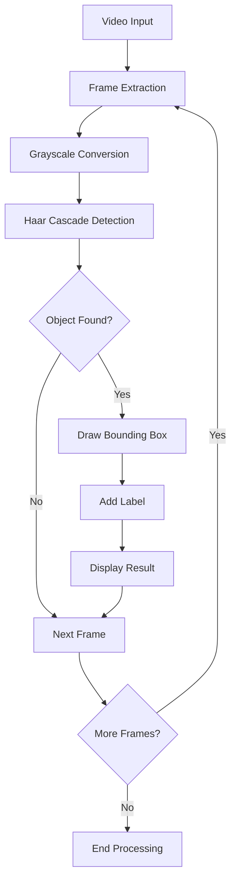

# 🚗 Vehicle and Pedestrian Detection using OpenCV

<p align="center">
  
  
  
  
</p>

<p align="center">
  
</p>

---

## 🌟 Overview

This project is a **real-time object detection system** that identifies vehicles and pedestrians in video footage using OpenCV's Haar Cascade classifiers. It's designed as a beginner-friendly introduction to computer vision and object tracking, demonstrating how to process video frames and detect objects in real-time.

---

## ✨ Key Features

### 🎯 **Real-Time Detection**
- **Vehicle Detection**: Identifies cars, trucks, and other vehicles
- **Pedestrian Detection**: Recognizes people in video footage
- **Frame-by-Frame Processing**: Smooth real-time video analysis

### 🔧 **Technical Implementation**
- **Haar Cascade Classifiers**: Pre-trained models for object detection
- **OpenCV Integration**: Efficient computer vision processing
- **Multi-Format Support**: Works with various video formats

### 📊 **Visual Output**
- **Color-Coded Bounding Boxes**:
  - 🔴 **Red Boxes** → Detected Vehicles
  - 🟡 **Yellow Boxes** → Detected Pedestrians
- **Real-Time Labels**: Object identification text overlay

### 🚀 **Beginner-Friendly**
- **Simple Setup**: Easy installation and execution
- **Educational**: Perfect for learning computer vision basics
- **Well-Documented**: Clear code structure and comments

---

## 📁 Project Structure

```
Vechicle_Pedestrian_Detection/
├── main.py                                           # Main detection script
├── requirements.txt                                  # Python dependencies
├── Vehicles_and_Pedestrian_Tracking_Using_OpenCV.ipynb  # Jupyter notebook version
├── haarcascades/
│   ├── haarcascade_car.xml                          # Vehicle detection classifier
│   └── haarcascade_fullbody.xml                     # Pedestrian detection classifier
└── Dataset (Sample Videos)/
    └── my_video.mp4                                 # Sample input video
```

---

## 🛠️ Setup and Installation

### Prerequisites

- **Python 3.7+**
- **Webcam** (for live detection) or **Video files** (for recorded footage)

### Installation Steps

**1. Clone the Repository**
```bash
git clone https://github.com/AadhavanAP/Vehicle-and-Pedestrian-Detection-using-OpenCV
cd Vechicle_Pedestrian_Detection
```

**2. Install Dependencies**
```bash
pip install -r requirements.txt
```

**3. Run the Application**
```bash
python main.py
```

---

## 🚀 Usage

### Running the Detection System

**Option 1: Script Execution**
```bash
python main.py
```

**Option 2: Jupyter Notebook**
```bash
jupyter notebook Vehicles_and_Pedestrian_Tracking_Using_OpenCV.ipynb
```

### Expected Output

✅ **After running the script:**

- 🟢 **Successful Execution**: Code runs without errors
- 📽️ **Video Playback**: Frame-by-frame video processing with detection overlays
- 🔴 **Red Bounding Boxes**: Highlight detected vehicles
- 🟡 **Yellow Bounding Boxes**: Highlight detected pedestrians
- 📊 **Real-Time Labels**: Object type identification on each detection

---

## 🎮 How It Works

### Detection Pipeline



### Technical Details

1. **Frame Processing**: Each video frame is converted to grayscale for efficient processing
2. **Haar Cascade Classification**: Pre-trained classifiers scan for vehicle and pedestrian patterns
3. **Object Detection**: Algorithm identifies objects based on learned features
4. **Bounding Box Rendering**: Detected objects are highlighted with colored rectangles
5. **Label Addition**: Object type is displayed above each detection

---

## 📋 Requirements

### Python Dependencies
```
opencv-python>=4.5.0
numpy>=1.19.0
```

### Hardware Requirements
- **CPU**: Any modern processor (multi-core recommended for better performance)
- **RAM**: Minimum 4GB (8GB recommended)
- **Storage**: At least 100MB free space
- **Camera**: Optional (for live detection)

---

## 📊 Performance Considerations

### Optimization Tips

- **Video Resolution**: Lower resolution videos process faster
- **Frame Rate**: Adjust processing speed based on hardware capabilities
- **Detection Parameters**: Fine-tune cascade parameters for better accuracy

### Typical Performance
- **Processing Speed**: 15-30 FPS (depends on hardware and video resolution)
- **Detection Accuracy**: 70-85% (varies with lighting and video quality)
- **Memory Usage**: 50-200MB (depends on video size)

---

## 🔧 Customization Options

### Adjusting Detection Parameters

```python
# In main.py, modify these parameters:
vehicles = vehicle_cascade.detectMultiScale(
    gray,
    scaleFactor=1.1,        # Adjust detection sensitivity
    minNeighbors=5,         # Minimum detections for valid object
    minSize=(30, 30)        # Minimum object size
)
```

### Adding New Object Types

1. Download additional Haar Cascade XML files
2. Load new classifiers in the script
3. Add corresponding detection and visualization code

---

## 🎯 Use Cases

### Educational Applications
- **Computer Vision Learning**: Understanding object detection basics
- **OpenCV Tutorial**: Hands-on experience with computer vision library
- **Algorithm Demonstration**: Visualizing how detection algorithms work

### Practical Applications
- **Traffic Monitoring**: Basic vehicle counting and tracking
- **Security Systems**: Pedestrian detection for surveillance
- **Research Projects**: Foundation for advanced detection systems

---

## 🚧 Limitations

- **Lighting Conditions**: Performance may vary in different lighting
- **Object Orientation**: Works best with front-facing objects
- **Detection Accuracy**: Haar cascades have limitations compared to modern deep learning methods
- **Real-Time Processing**: Speed depends on hardware capabilities

---

## 🔮 Future Enhancements

### Potential Improvements
- **Deep Learning Integration**: Upgrade to YOLO or SSD models
- **Multi-Object Tracking**: Add object tracking across frames
- **Performance Metrics**: Include accuracy and speed measurements
- **GUI Interface**: Create user-friendly graphical interface
- **Configuration File**: Add settings for easy parameter adjustment

---

## 🤝 Contributing

Contributions are welcome! Here's how you can help:

1. **Fork the Repository**
2. **Create a Feature Branch**
   ```bash
   git checkout -b feature/YourFeatureName
   ```
3. **Make Changes and Commit**
   ```bash
   git commit -m "Add your feature description"
   ```
4. **Push to Branch**
   ```bash
   git push origin feature/YourFeatureName
   ```
5. **Open a Pull Request**

### Areas for Contribution
- **Performance Optimization**: Improve processing speed
- **Additional Features**: Add new detection capabilities
- **Documentation**: Enhance code comments and guides
- **Bug Fixes**: Report and fix any issues

---

## 📚 Learning Resources

### OpenCV Documentation
- [OpenCV Python Tutorials](https://docs.opencv.org/4.x/d6/d00/tutorial_py_root.html)
- [Haar Cascade Detection](https://docs.opencv.org/3.4/db/d28/tutorial_cascade_classifier.html)

### Computer Vision Concepts
- [Object Detection Fundamentals](https://towardsdatascience.com/object-detection-with-deep-learning-a-review-4e5d7f7f8e04)
- [Real-Time Processing Techniques](https://www.pyimagesearch.com/2018/12/31/keras-conv2d-and-convolutional-layers/)

---

## 📄 License

This project is licensed under the **MIT License**. See the [LICENSE](LICENSE) file for details.

---

## 🙏 Acknowledgments

- **Original Tutorial**: [How to Detect Objects in Real-Time Using OpenCV and Python](https://towardsdatascience.com/how-to-detect-objects-in-real-time-using-opencv-and-python-c1ba0c2c69c0)
- **OpenCV Community**: For the excellent computer vision library
- **Original Creator**: [theshredbox](https://github.com/theshredbox) for the foundational code
- **Haar Cascade Models**: OpenCV community for pre-trained classifiers

---

## 📞 Support

If you encounter any issues or have questions:

1. **Check the Issues**: Browse existing [GitHub Issues](https://github.com/AadhavanAP/Vechicle_Pedestrian_Detection/issues)
2. **Create New Issue**: Report bugs or request features
3. **Documentation**: Refer to this README and code comments

---

<p align="center">
  <strong>⭐ If you found this project helpful, please give it a star! ⭐</strong>
</p>

<p align="center">
  Made with ❤️ by <a href="https://github.com/AadhavanAP">AadhavanAP</a>
</p>
